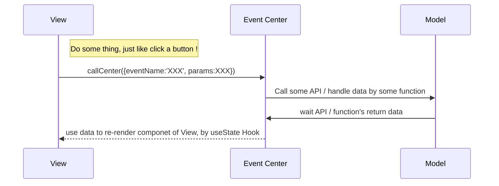

# MVEC architecture

```mermaid
sequenceDiagram
  Note right of View: Do some thing, just like click a button !
  View->>Event Center: callCenter({eventName:'XXX', params:XXX})
  Event Center->>Model: Call some API / handle data by some function 
  Model->>Event Center: wait API / function's return data
  Event Center-->>View: use data to re-render componet of View, by useState Hook
```